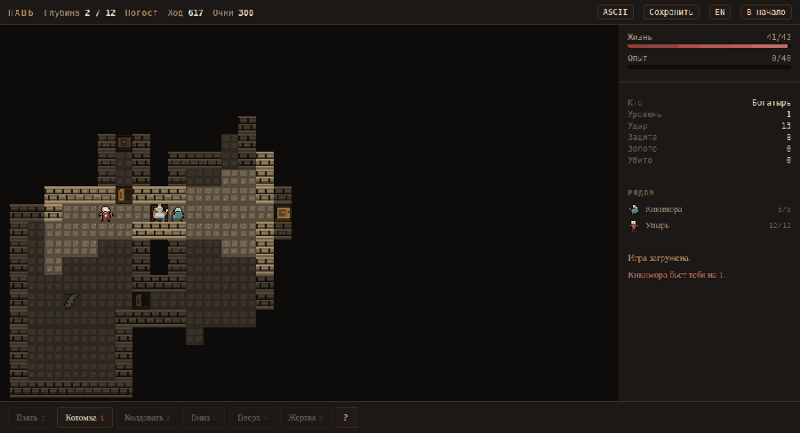
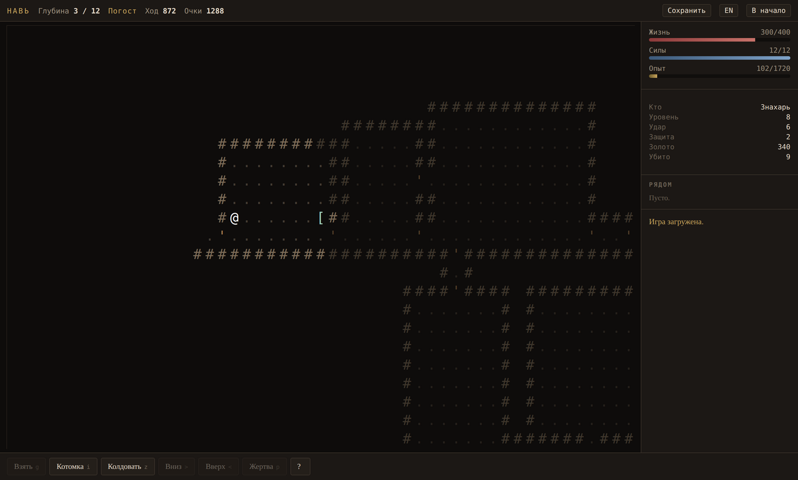
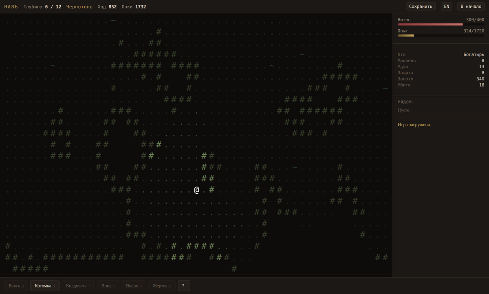
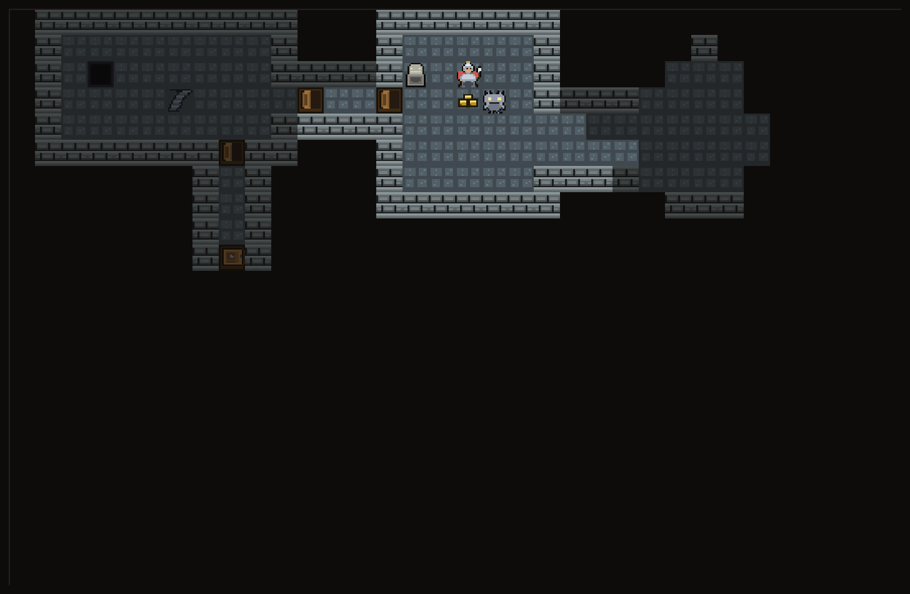
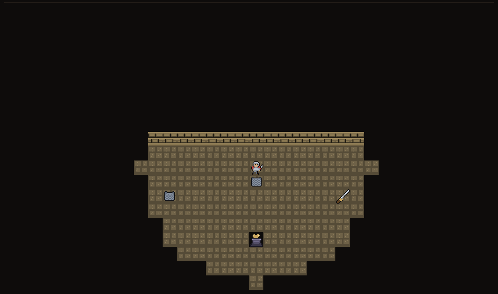
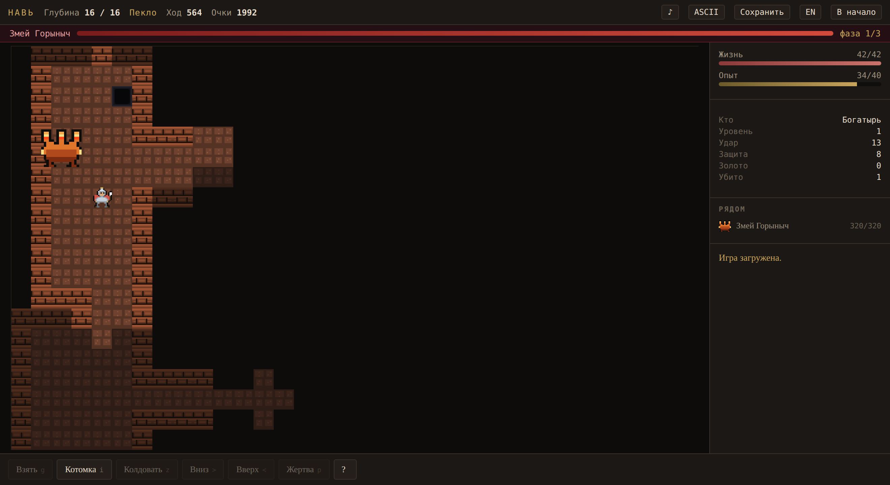
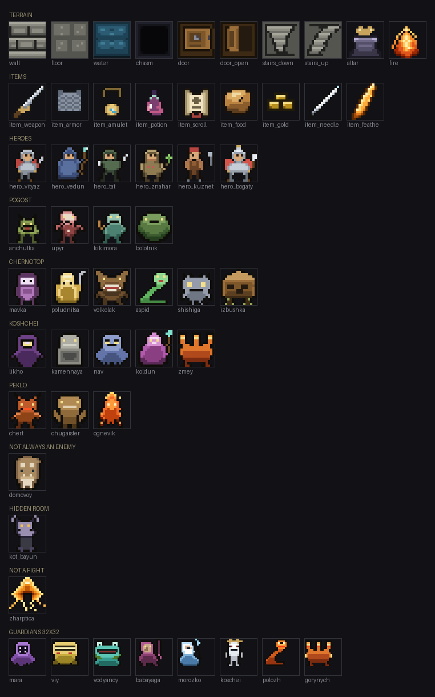
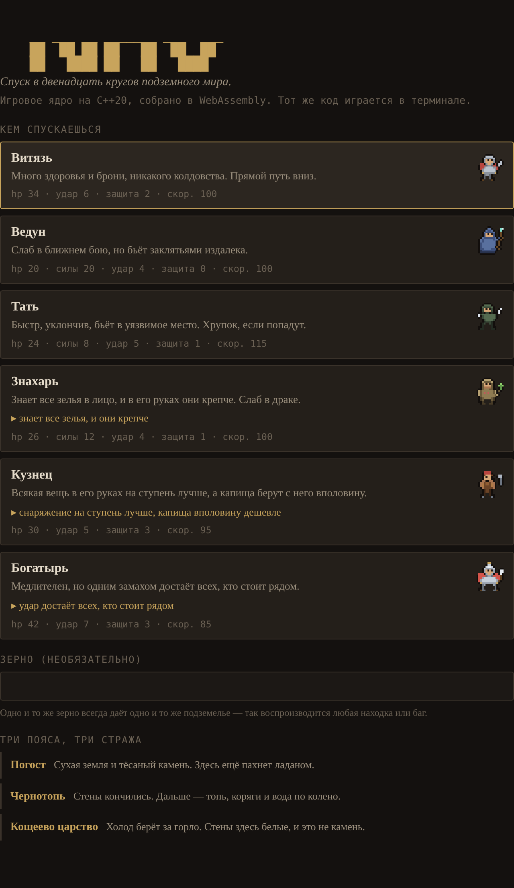
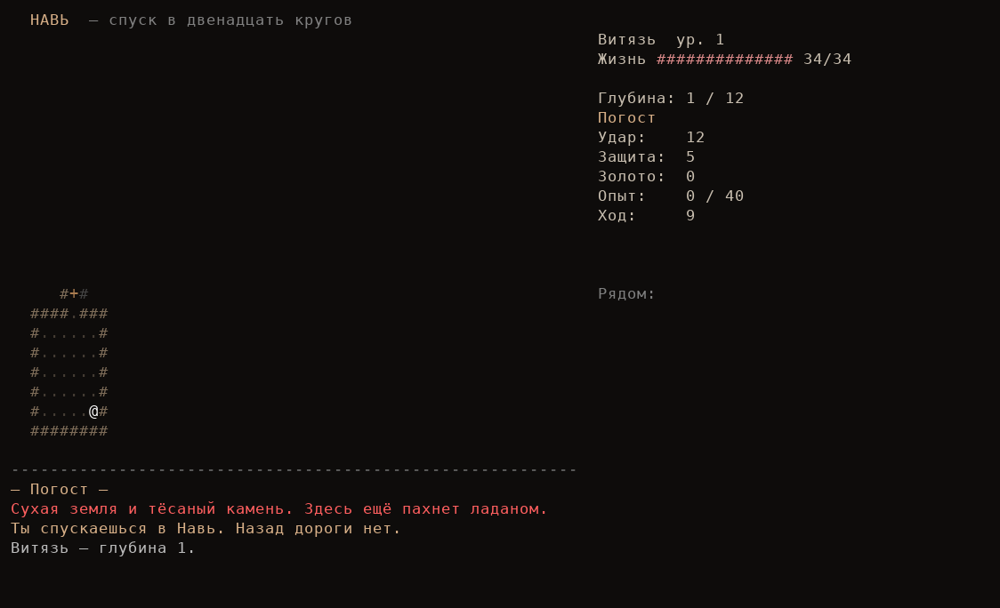

<div align="center">

# Навь

**Пошаговый роглайк по мотивам славянской нечисти.**
Игровое ядро написано на C++, собирается и в терминал, и в браузер через WebAssembly.

[](https://github.com/TheToshix/nav-roguelike/actions/workflows/ci.yml)
[](https://github.com/TheToshix/nav-roguelike/actions/workflows/pages.yml)
[](CMakeLists.txt)
[](tests/)
[](docs/TEST_PLAN.md)
[](LICENSE)

### ▶ [Играть в браузере](https://thetoshix.github.io/nav-roguelike/)

[English](README.en.md) · [Как запустить](docs/RUNNING.md) · [Архитектура](docs/ARCHITECTURE.md) · [Тест-план](docs/TEST_PLAN.md) · [Тест-кейсы](docs/TEST_CASES.md) · [Багрепорты](docs/BUG_REPORTS.md)



</div>

---

## Что это

Шестнадцать этажей вниз, в Навь — подземный мир славянских сказок. Смерть окончательна:
сохранение — это пауза, а не запасная жизнь.

Каждое подземелье порождается заново из зерна. Одно и то же зерно всегда даёт один и тот же
этаж, тех же врагов и те же предметы — поэтому любую находку и любой баг можно воспроизвести
одной строкой.

### Четыре пояса, восемь стражей

Спуск разбит на четыре части по четыре этажа. У каждой свой генератор, своя палитра, свои
опасности, свой хозяин на дне и меньший страж на середине — так шестнадцать этажей читаются
как путь, а не как повторение.

| Пояс | Глубина | Что там | На середине | Внизу |
|---|---|---|---|---|
| **Погост** | 1–4 | Сухие склепы и коридоры, двери, редкая вода | Мара | **Вий** |
| **Чернотопь** | 5–8 | Пещеры вместо комнат, вода почти везде, ни одной двери | Водяной | **Баба-Яга** |
| **Кощеево царство** | 9–12 | Холодные залы, провалы под ногами | Морозко | **Кощей Бессмертный** |
| **Пекло** | 13–16 | Горячий камень, огненные реки, пропасти | Огненный Полоз | **Змей Горыныч** |



<table>
<tr>
<td></td>
<td></td>
</tr>
<tr>
<td align="center"><sub><b>Чернотопь</b> — пещеры клеточного автомата</sub></td>
<td align="center"><sub><b>Кощеево царство</b> — залы и провалы</sub></td>
</tr>
</table>

### Перекрёсток

Партия начинается не на этаже, а в комнате. Перекрёсток — единственное место в игре,
которое ничем не порождается: он написан руками. Из нечисти — только Соловей-Разбойник у дороги вниз; ещё есть капище, лестница
вниз и три вещи на постаментах.



Взять можно ровно одну — остальные две перекрёсток забирает себе. Правило живёт не во
флаге на предмете, а в одной строчке в `act_pick_up`: три вещи и одна пара рук — это и
есть вся идея комнаты. Зерно решает, какие три; то же зерно всегда предложит те же.

У дороги вниз сидит **Соловей-Разбойник** — не страж (ни зала, ни музыки, ни в таблице
боссов), а разовая встреча: он не сходит с места, но каждый третий ход свистит, и свист
сшибает героя вбок с тропы, отнимает ход и слегка ранит. Убей его или проскочи мимо —
так или иначе это случается ровно один раз, в самом начале.

С первого этажа на перекрёсток можно вернуться. Глубже — уже нет.

### У стража есть зал, и дверь за тобой закрывается

Босса, которого можно вытянуть в коридор и бить по клетке за раз, — не босс, а монстр с
большой полоской здоровья: всё, что делает стража интересным (избы Бабы-Яги, залитый пол
Водяного, огонь, идущий по линии), требует места. Поэтому у каждого мастера пояса — Вия,
Бабы-Яги, Кощея и Горыныча — есть зал, в котором стоит и лестница вниз.

Порог подписан заранее: подойдя к двери, ты читаешь, что за ней ждут и что войти — значит
запереть за собой дверь. Решение остаётся за игроком, и это единственное, что отличает
сложность от подлости. Двери закрываются, только когда ты сам шагнул внутрь, и открываются,
когда страж падает. Держат они обе стороны: ни герой не выйдет, ни страж — правило одно на
двоих, потому что два правила рано или поздно разойдутся, и узнают об этом по боссу, который
уходит сквозь стену.

Кощей — исключение, и по делу: его смерть на конце иглы, которая лежит где-то ещё на этаже.
Запертый зал был бы комнатой, из которой нельзя выйти победителем.

Зал вырезается в уже готовом этаже — стенами по кольцу и одной дверью, — а потом проверяется,
не разрезал ли он этаж надвое. Если разрезал, вырез откатывается целиком и пробуется другое
место; когда подходящее место нашлось не там, где стояла лестница, лестница переезжает к нему.
Этаж, оставшийся без зала, — маленькая потеря; этаж с недостижимой половиной — сломанная игра.

Тем же приёмом на середине Чернотопи и Кощеева царства иногда прячется **тайная комната**:
маленький зал, вырезанный в глухой скале и закрытый обычной дверью — а дверь не пропускает
взгляд, так что из коридора комната читается сплошной стеной. Внутри — **Кот Баюн**,
необязательный мини-босс: с дистанции он заводит песню, и она отнимает у героя ход целиком
(отдельный эффект «сон», не морок и не оковы). Стережёт он «Кошачий глаз» — оберег, после
которого песня уже не берёт.

Изредка на этаже встречается тот, с кем драться не нужно. **Домовой** не нападает первым:
пройди мимо, не потревожив, — и он оставит короткий баф и исчезнет; ударишь — станет обычным
врагом. **Жар-птица** не даётся в руки: увидев героя, каждый ход отступает на клетку. Загони
её в тупик или обгони (спешка, «скороходные» вещи) — и она обронит перо, которое один раз
удержит тебя на этом свете, само.

### Боссы дерутся по своим правилам

Ни один из трёх не является просто мешком с хитпоинтами. У каждого механика взята из
первоисточника, и у каждой есть контригра.

**Вий** три хода стоит с опущенными веками — и в это время получает урон в полтора раза
больше обычного. На четвёртый он их поднимает, и всё, что попало во взгляд, получает тяжёлый
удар и слепоту. За ход до этого приходит предупреждение. Ответ ровно тот, что в повести:
уйти с глаз.

**Баба-Яга** приходит не одна: рядом с ней стоят избы на курьих ножках. Пока хоть одна стоит,
удары по хозяйке почти не проходят, а она отступает и зовёт подмогу. Сначала избы.

**Кощей** не умирает. Сбитый до нуля, он поднимается снова — потому что смерть его на конце
иглы, а игла лежит где-то на том же этаже. После первого воскрешения этаж открывается на
карте целиком: механика, о которой нельзя догадаться, — это не загадка, а издевательство.

**Змей Горыныч** ждёт на самом дне. У него три головы, и это не украшение: на каждом пороге
здоровья одна падает, а оставшиеся перестают беречь огонь. Три головы дышат раз в три хода,
две — раз в два, последняя — каждый ход и вдогонку.

### У каждого боя есть вторая половина

Босс, у которого меняется только число в полоске здоровья, — это стена, а не бой. Поэтому у
каждого стража две или три фазы, и на порогах в две трети и одну треть здоровья меняется не
урон, а поведение.

| Кто | Что меняется |
|---|---|
| **Вий** | Цикл век сокращается: четыре хода, потом три, потом два. Ответ тот же — уйти с глаз, — но окно, чтобы бить, сжимается |
| **Баба-Яга** | Сначала её берегут избы. Потом она садится в ступу и становится быстрее героя. Под конец поднимает новую избу |
| **Кощей** | Перестаёт бить и начинает тянуть: его раны затягиваются твоими. На третьей фазе зовёт навь из стен |
| **Змей Горыныч** | Теряет голову за фазу и с каждой потерянной дышит чаще |
| **Мара** | На второй фазе двоится и зовёт подмогу |
| **Водяной** | Затапливает пол вокруг себя — а в воде он лечится |
| **Морозко** | Спрашивает «тепло ли тебе?» на ход раньше удара; на второй фазе морозит дольше |
| **Огненный Полоз** | Уходит в камень и выходит рядом с тобой. Расстояние перестаёт быть безопасностью |

Фаза только растёт: вылеченный босс не возвращает игроку рисунок, который тот уже разгадал.
Смена фазы всегда объявляется строкой в журнале и видна в полоске над картой — иначе с той
стороны экрана это читается как жульничество.



Стражи и рисуются вдвое крупнее: спрайт 16×16, выведенный в удвоенном масштабе, стоит на
своей клетке и нависает над соседними. Занимает он по-прежнему одну клетку — настоящая
многоклеточная тварь сломала бы проход, обзор, поиск пути и сохранения разом, и это
классический источник тихих багов в роглайках. Здесь картинка предупреждает о том, о чём
правила молчат, и ничего при этом не трогает.

### Музыка — своя, ни одного файла

У каждого из восьми боссов своя тема, и она меняется вместе с фазой. В репозитории нет ни
одного mp3: `frontend/web/music.js` — маленький синтезатор на Web Audio, который собирает
дрон, пульс и мотив из осцилляторов и шума. Лады минорные и модальные, к третьей фазе
фильтр открывается, темп растёт и добавляется слой.

Проверяется это не на слух: тема рендерится в `OfflineAudioContext`, и тест смотрит, что
сигнал есть, что громкость третьей фазы заметно выше первой и что на переходах нет разрыва,
который слышен как щелчок.

### Графика — своя, 16×16, нарисованная текстом

Играть можно и символами, и картинками: кнопка **ASCII** в верхней панели (или `G`)
переключает рендер на лету. Оба режима получают один и тот же кадр — движок отдаёт для
каждой клетки и символ, и ключ спрайта.



Пятьдесят пять спрайтов: десять тайлов и эффектов, девять предметов, шесть героев и тридцать тварей.
Ни одного PNG в репозитории — вся графика лежит в `tools/sprites/pixels.py` текстом, по
шестнадцать строк на спрайт, где точка это прозрачность, а остальные знаки — ключи в
палитру самого спрайта:

```python
beast('volkolak', {'1': '#4a3520', '2': '#6f4f2d', '3': '#8f6b40', 'w': '#e8e0d0',
                   'r': '#a8433c'}, [
    '.oo..........oo.',
    'o33o........o33o',
    'o333oo....oo333o',
    '.o3333oooo3333o.',
    '.o33e333333e33o.',
    ...
```

Так у графики появляется то, чего у PNG не бывает: изменённый пиксель виден в diff'е
обычной строкой, а не как «binary files differ». `tools/sprites/build.py` собирает из
этого `frontend/web/sprites.js` (палитра плюс 256 знаков на спрайт — 14 КБ на всё) и
контактный лист выше. Отдельная задача в CI пересобирает файл и падает, если
закоммиченный отстал от исходника.

**Земля и тот, кто на ней стоит, рисуются отдельно.** Движок сообщает `terrain` и
`entity` разными полями, поэтому упырь на лестнице больше не стирает лестницу.

**Один камень на четыре пояса.** Тайлы нарисованы нейтрально-серыми и подкрашиваются
цветом текущего пояса умножением — иначе понадобилось бы три копии каждого тайла и три
шанса забыть про одну из них.

Тест `Sprites.*` проходит по всем тайлам, видам нечисти, предметам и классам и требует
для каждого нарисованный спрайт — и наоборот, ловит спрайт, которого никто не просит.
Читает он при этом сам сгенерированный файл, а не второй список рядом с движком: список
согласился бы с движком и разошёлся бы с картинками.

## Что здесь интересного с инженерной стороны

**Одно ядро — две сборки.** Вся логика игры лежит в `engine/` и не знает ничего о вводе-выводе:
никакого `printf`, никакого чтения клавиш. Фронтенды присылают `Action` и читают состояние обратно.
Терминальная версия и версия для браузера — это два разных файла по 600 строк вокруг одного и того же
кода. Ровно это делает правила проверяемыми юнит-тестами без экрана.

**Детерминизм как требование, а не как приятный побочный эффект.** Свой генератор случайных чисел
(xoshiro256\*\* с посевом через splitmix64): `std::uniform_int_distribution` даёт разные результаты
в libstdc++, libc++ и MSVC, а значит одно зерно давало бы разные подземелья на разных платформах.
Состояние генератора входит в сохранение, поэтому загруженная игра продолжает ту же
последовательность. Тест `Integration.TheSameSeedAndActionsProduceTheSameRun` сравнивает два
прогона побайтово.

**Связность этажа доказывается, а не надеется.** Генератор режет уровень BSP-разбиением, соединяет
комнаты по дереву, а потом отдельным проходом ищет отрезанные области и пробивает к ним туннель.
Инвариант «каждая проходимая клетка достижима от входа» проверяется на 300 зёрнах и на всех
шестнадцати этажах — включая самый опасный случай, когда этаж усыпан пропастями.

**Симметричный обзор.** Первая версия использовала классическое рекурсивное теневое литьё. Оно
быстрое и выглядит правильно, но несимметрично: находились клетки, откуда врагу видно героя, а
герою врага — нет. Для игры со стрелками́ на расстоянии это читается как жульничество. Тест на
симметрию поймал это сразу, и алгоритм заменён на симметричную формулировку Альберта Форда.

**Карта потоков вместо A\* на каждого монстра.** Одно построение Дейкстры от героя за ход
обслуживает всех врагов сразу: спуск по полю — погоня, подъём — бегство. A\* остаётся запасным
путём, когда поле заблокировано в узком коридоре.

**Сохранения переживают враждебный ввод.** Формат текстовый и версионированный, сетки тайлов
сжаты RLE (этаж 72×34 занимает ~2 КБ, вся игра — единицы килобайт, что важно для `localStorage`).
Загрузка строгая: любая испорченная запись отклоняется целиком и не оставляет движок в
полусобранном состоянии. Тест обрезает сохранение на каждой из десятков длин и проверяет, что
ни одна не принимается.

## Игровые механики

| | |
|---|---|
| **Классы** | Шесть, и у трёх из них не разброс характеристик, а своя механика (см. ниже) |
| **Бестиарий** | 22 вида с разными повадками: погоня, стрельба, бегство при ранении, призыв подмоги, хаотичное движение, поджог пола под собой; один — не всегда враг |
| **Боссы** | Восемь: четыре хозяина поясов и четыре меньших стража. У каждого своя механика и две-три фазы |
| **Предметы** | 33 вида снаряжения (четыре набора из трёх частей и одна пара из двух — бонус за обе сразу; часть находок проклята и не снимается без свитка), 8 зелий, 9 свитков; зелья и свитки не подписаны, пока их не испробуешь |
| **Магия** | 6 заклятий с наведением по линии видимости |
| **Эффекты** | Яд, горение, оковы, морок, слепота, спешка, замедление, регенерация, ярость, оберег, сон |
| **Бестиарий-кодекс** | Экран (`v` или меню) со списком нечисти: строка открывается при первой встрече, прогресс лежит в сохранении |
| **Достижения** | Набор ачивок (без урона до 8 этажа, победа без бега, конкретным классом, спидран); прогресс между запусками в `~/.nav_achievements` |
| **Ежедневный сид** | Кнопка/клавиша `D`: общий для всех сид дня (по календарю UTC); результат ложится в ту же таблицу рекордов с отдельной колонкой и фильтром |
| **События этажа** | У трёх поясов есть своё: половодье в Чернотопи (вода прибывает), метель в Кощеевом царстве (обзор сжимается), пожар в Пекле (огонь расходится). Выпадает не на каждом этаже, решается отдельным потоком ГПСЧ — генерация не сдвигается |
| **Концовки** | Экран победы дописывает эпилог по тому, как всё прошло: класс героя, тронул ли последний страж, за сколько ходов. Парный к «разбору смерти» на экране поражения |
| **Доступность** | Палитра для дальтоников (красно-зелёная слепота) в настройках обоих фронтендов: зелень уходит в синеву, красное — в оранжевое, и болото перестаёт путаться с Пеклом |
| **Прочее** | Голод, вода и пропасти, двери, капища для освящения оружия, система очередей ходов по скорости, сохранения |

### Снаряжение, которое что-то делает

Двенадцать вещей из тридцати несут механику, а не прибавку к числу: палица иной раз сшибает
с ног, рогатина бьёт крупных в полтора раза, сорочка-неуязвимка уводит один удар за этаж,
бахтерец возвращает треть полученного, навий нож забирает у убитого, зеркальце удешевляет
заклятья, свеча светит там, где света нет.

Они же собираются в четыре набора — по одному оружию, одному доспеху и одному оберегу в
каждом. Три предмета и ровно три слота выбраны не случайно: собрать набор — значит занять
всё, что у героя есть, то есть решить не про руку, а про весь спуск.

| Набор | Из чего | Что даёт целиком |
|---|---|---|
| **Обережный круг** | Рогатина, сорочка-неуязвимка, наузы | Ни морок, ни слепота не пристают |
| **Ратный сбор** | Палица, бахтерец, гривна | Каждый удар достаёт всех, кто рядом |
| **Навий сговор** | Навий нож, саван, зеркальце | Убитый отдаёт здоровье и силы |
| **Ходовой припас** | Клюка, лапти-скороходы, свеча | Вода больше не держит |

Каждая вещь работает и в одиночку: набор, бесполезный до последнего предмета, — это ловушка,
а не выбор, и отдельный тест этого требует.

### Шесть героев

| Класс | Чем берёт | Особенность |
|---|---|---|
| **Витязь** | Здоровье и броня | — |
| **Ведун** | Заклятья на расстоянии | — |
| **Тать** | Скорость, уклонение, критические удары | — |
| **Знахарь** | Зелья | Знает все зелья с первого хода, и в его руках они на половину крепче |
| **Кузнец** | Снаряжение | Всякая вещь считается на ступень лучше, капища берут вполовину дешевле |
| **Богатырь** | Ближний бой | Каждый удар достаёт всех, кто стоит рядом; за это — медлительность |

### Ходить пешком по клетке — скучно, и это чинится

Клавишу движения можно **зажать** — герой идёт, пока её держат, а `Shift` при этом работает
спринтом. Игра при этом остаётся пошаговой: страница просто просит движок сделать всё тот же
одиночный шаг ещё раз, поэтому чудища ходят между шагами, голод идёт, а инварианты держатся —
движок не отличает зажатую клавишу от терпеливого пальца. Короткое нажатие `Shift` с
направлением по-прежнему бежит до развилки одним действием, `o` доводит до ближайшего места,
где герой ещё не был, `m` показывает весь изученный этаж целиком с лестницей вниз.

На телефоне то же самое: экранный крестовик можно держать. Тыкать в одну и ту же стрелку
тридцать раз — это ровно то, из-за чего игру закрывают.

Интересна во всём этом не езда, а тормоза. Движение останавливается, когда кто-то появился в
виду, когда героя ранили, когда подействовало что-то новое и когда под ногами вещь, лестница
или капище; бег вдобавок встаёт на развилке, а автообход вообще отказывается идти, если рядом
кто-то есть.

Правило остановки одно на всех — `Game::situation()` и `situation_changed()` в движке. Его
читают и бег, и автообход, и зажатая клавиша в терминале, и зажатая клавиша в браузере
(движок присылает свой снимок обстановки в каждом кадре, страница только сравнивает два).
Три похожих правила в трёх местах разошлись бы, и разошлись бы тихо: зажатая клавиша, которая
доводит героя до чудища, — худшее, что эта возможность может сделать.

В терминале то же самое достигается с другой стороны: клавиши, накопившиеся в буфере, пока
игра думала, выбрасываются, как только обстановка изменилась. Иначе игрок видит чудище,
отпускает клавишу — а герой доигрывает полсекунды нажатий ему в лицо.

### Бой, который можно понять

Удар по герою сообщает, сколько прошло **на самом деле** и сколько осталось: «Анчутка бьёт
тебя на 7 — осталось 12/34». Раньше он сообщал, сколько выпало на костях, и умалчивал о том,
что сорочка-неуязвимка удар съела. Эффект называет себя и свою длительность вместо «тебя
задело чем-то дурным».

В котомке рядом с каждой вещью написано, что изменится, если её надеть: `+2 удар, −1 защита`,
зелёным или красным. Считает это движок — надевает вещь, спрашивает лист персонажа и снимает
обратно, — поэтому предпросмотр не может разойтись с тем, что произойдёт на самом деле. Тест
проверяет именно это равенство, а не сами числа.

### Смерть объясняет себя

Смерть здесь окончательна, поэтому она обязана быть понятной. На экране конца — последние пять
ударов с ходом, источником, уроном и остатком здоровья, и отдельно список того, что так и
осталось в котомке. Чаще всего это и есть ответ на вопрос «что я сделал не так»: зелье лечения
лежало в котомке всю дорогу.

### Таблица рекордов

Смерть здесь окончательна, и единственное, что остаётся от партии, — строка в таблице. Она
хранит десять лучших спусков: очки, глубину, класс и зерно, по которому партию можно повторить.
Порядок — по очкам, при равенстве по глубине, а при равной глубине выигрывает тот, кто потратил
меньше ходов. Считает и упорядочивает движок, а не фронтенд: обе версии показывают одну и ту же
таблицу и не имеют права разойтись во мнении о том, чего стоила партия. Терминал кладёт её в
`~/.nav_scores`, браузер — в своё хранилище.

Обе языковые версии — русская и английская — живут в движке: каждая строка хранится сразу в двух
вариантах, поэтому язык переключается в любой момент, включая уже написанные строки журнала.



## Как запустить

Коротко — ниже. Подробно, с установкой всего с нуля и разбором типичных ошибок, —
в [docs/RUNNING.md](docs/RUNNING.md).

### Браузер

Ничего собирать не нужно — [играть онлайн](https://thetoshix.github.io/nav-roguelike/).

### Терминал

```bash
git clone https://github.com/TheToshix/nav-roguelike.git
cd nav-roguelike
cmake -S . -B build -DCMAKE_BUILD_TYPE=Release
cmake --build build -j
./build/nav
```

Нужен компилятор с C++17 (GCC 9+, Clang 10+, MSVC 2019+) и CMake 3.16+.
Собирается и проверяется на Linux, macOS и Windows.

### Тесты

```bash
ctest --test-dir build --output-on-failure    # 451 тест
./build/nav --demo 20                         # 20 полных партий без экрана
./build/nav --sweep 4                         # обходчик: дойти до дна и убить всех стражей
```

### Веб-сборка

```bash
source /path/to/emsdk/emsdk_env.sh
./tools/build_web.sh          # кладёт index.html и nav.js в dist/
python3 -m http.server -d dist 8080
```

## Настройки и телефон

Всё, что можно переключить, переключается прямо в игре: схема управления, вид карты, спрайты
или ASCII, музыка боссов, язык. Экран настроек открывается и с титульного экрана, и из партии,
а каждая настройка — это подписанный ряд вариантов с выделенным текущим.

Так вышло не от любви к настройкам. До этого схема управления жила на кнопке с надписью
`HJKL` — то есть кнопка была подписана своим текущим состоянием, а не тем, что она сделает.
Игрок, которому нужен был WASD, читал её как заголовок и делал единственный возможный вывод:
WASD не работает (см. [NAV-016](docs/BUG_REPORTS.md)).

Карта по умолчанию показывает **весь этаж целиком**, если клетка при этом остаётся читаемой,
и только на маленьком экране переходит к окну, которое следует за героем. Раньше окно было
всегда, и на большом мониторе это читалось как «часть игры за кадром».

На телефоне игра рассчитана на горизонтальную ориентацию: карта во всю высоту, панель сбоку
как на десктопе, крестовик и действия — плавающими блоками в тех углах, где и так лежат
большие пальцы. Вертикальная тоже работает и тоже переписана. Проверяется это не на глаз:
страница открывается в трёх размерах телефона, и попарно сравниваются прямоугольники всех
кнопок, полос и таблиц — любое пересечение больше двух пикселей означает падение проверки.

## Управление

Схем две, и переключаются они прямо в игре — на титульном экране по `k`, в партии через
меню по `Esc`, в браузере кнопкой наверху. Выбор запоминается между партиями.

| | Классическая | WASD |
|---|---|---|
| Идти (можно зажать) | `hjkl` `yubn` | `wasd` `qezc` |
| Спринт (зажать) / бег до развилки (нажать) | `Shift` + то же | `Shift` + то же |
| Бросить вещь | `d` | `r` |
| Колдовать | `z` | `f` |
| Выйти | `q` | через меню |
| Сохранить / загрузить | `S` `R` | через меню |

Всё остальное одинаково в обеих схемах: стрелки и цифровой блок тоже ходят, `.` или `5` —
переждать ход, `g` — подобрать, `i` — котомка, `o` — дойти до неизведанного, `m` — карта
этажа, `>` `<` — лестницы, `p` — жертва на капище, `T` — язык, `?` — справка, `Esc` — меню.
В браузере ещё `G` переключает спрайты и ASCII, а `M` — музыку.

Справка не написана руками: и она, и раскладка берутся из одной таблицы в движке
(`engine/src/keys.cpp`), поэтому схема не может обзавестись клавишей, о которой справка
забыла умолчать. Тест на это есть.

В браузере всё то же самое плюс мышь и экранный крестовик на телефоне.



## Тестирование

Проект писался с тестами с первого дня, а не «покрывался» ими потом. Подробности —
в [тест-плане](docs/TEST_PLAN.md), [тест-кейсах](docs/TEST_CASES.md) и
[багрепортах](docs/BUG_REPORTS.md), где записаны семнадцать дефектов, найденных в ходе разработки,
вместе с шагами воспроизведения и правками.

| | |
|---|---|
| Юнит- и интеграционных тестов | **451** в 54 наборах |
| Покрытие движка по строкам | **94%** |
| Платформы в CI | Linux (GCC, Clang), macOS, Windows (MSVC) |
| Дополнительно в CI | ASan + UBSan, `-Werror`, отчёт покрытия, 20 полных партий без экрана, обходчик до 16 этажа, сборка WebAssembly |

Отдельно стоит отметить два подхода, которые дали больше всего:

**Свойства вместо примеров.** Вместо «на зерне 42 должен получиться вот такой этаж» проверяется
«на любом зерне каждая клетка достижима». Такие тесты не ломаются от безобидных правок генератора
и ловят ровно то, что должны.

**Инварианты после каждого хода.** Тест `Integration.InvariantsHoldThroughoutLongRandomisedRuns`
прогоняет случайные партии по 1500 ходов и после каждого хода проверяет полтора десятка условий:
здоровье в границах, герой не внутри стены, два монстра не стоят на одной клетке, индексы
экипировки указывают на существующие предметы нужного типа. Так находятся состояния, которые
никакой ручной сценарий не построит.

**Вероятностные механики измеряются, а не угадываются.** «Вий мягче с опущенными веками» и
«избы защищают Бабу-Ягу» — это утверждения про распределение, а не про один удар. Такие тесты
усредняют десятки прогонов и требуют не «меньше», а «меньше вдвое», иначе они мигали бы.

**Бот, который доходит до конца.** Игру проверяют два бота, потому что вопросов два.
`--demo N` играет честно, с теми характеристиками, которые даёт игра, и показывает кривую
сложности: сейчас партии заканчиваются на 3–5 этаже. `--sweep N` берёт того же бота, но
перекачанного, и отвечает на другой вопрос — достижима ли вторая половина игры вообще;
прогон засчитывается, только если герой дошёл до 16 этажа и положил всех восьмерых стражей.

Второй бот стоило написать хотя бы ради одного: до него ни одна партия не заходила дальше
пятого этажа, то есть одиннадцать этажей и шесть стражей существовали только в тестах-аренах.
Первый же обходчик нашёл четыре дефекта, из-за которых вторая половина игры была недостижима
или ломалась, — от иглы Кощея, разложенной не на том этаже, до победы, засчитанной на четыре
этажа раньше срока. Оба бота теперь гоняются в CI.

## Структура

```
engine/          ядро: правила игры, без ввода-вывода
  include/nav/   публичные заголовки
  src/           генерация карт, обзор, поиск пути, бой, ИИ, сохранения
frontend/
  terminal/      ANSI-рендер, сырой ввод с клавиатуры и бот для прогонов
  web/           C-обёртка для WebAssembly, страница игры и спрайты
tests/           451 тест на GoogleTest
docs/            как запустить, архитектура, тест-план, тест-кейсы, багрепорты
tools/           сборка веб-версии
  sprites/       пиксель-графика как текст и генератор из неё
```

## Лицензия

[MIT](LICENSE).

---

<div align="center">
<sub>Тимофей Иотмалик · <a href="https://github.com/TheToshix">github.com/TheToshix</a> · <a href="https://t.me/TheToshix">@TheToshix</a></sub>
</div>
